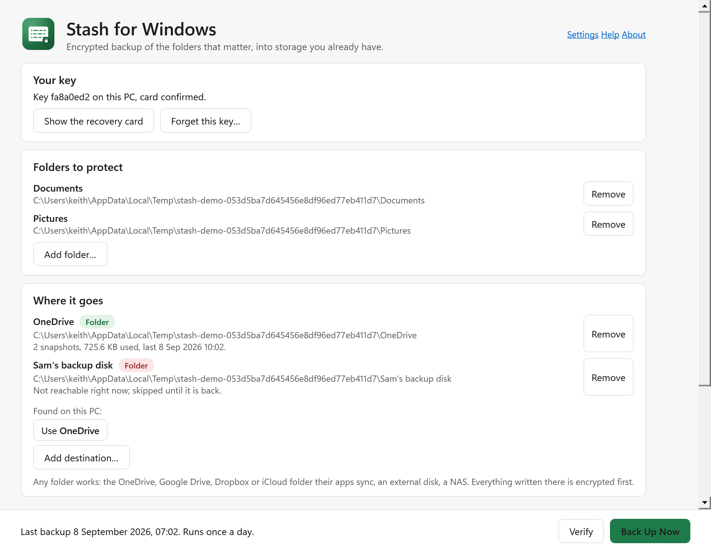

# Stash for Windows

Encrypted backup of the folders that matter, into the storage you already have: the OneDrive that comes with Microsoft 365, the Google Drive that comes with Gmail, Dropbox, iCloud for Windows, an external disk, a NAS. Several at once, on a schedule, uploading only what changed. The provider only ever holds scrambled blobs. You hold the key, as 24 words on a card.

Free, MIT licensed, no account, no server, no subscription. The same format and the same card as [Stash for Mac](https://github.com/keithadler/stashmac): a backup made on either restores on both.

## Download

**[Download Stash-for-Windows-1.0.0-x64.exe](https://github.com/keithadler/stashwin/releases/latest/download/Stash-for-Windows-1.0.0-x64.exe)** for ordinary Intel and AMD PCs, or **[Stash-for-Windows-1.0.0-arm64.exe](https://github.com/keithadler/stashwin/releases/latest/download/Stash-for-Windows-1.0.0-arm64.exe)** for Windows on ARM. Windows 10 or 11. One exe, no installer, no runtime to install; put it anywhere and double-click.

The console twin for scripts and the schedule: [stash-1.0.0-x64.exe](https://github.com/keithadler/stashwin/releases/latest/download/stash-1.0.0-x64.exe) and [stash-1.0.0-arm64.exe](https://github.com/keithadler/stashwin/releases/latest/download/stash-1.0.0-arm64.exe). Put it next to the app as `stash.exe` so the schedule can run it.

The first time, Windows SmartScreen says it does not recognise the app: click **More info**, then **Run anyway**. That is once. The app is signed by its author, not by a certificate bought from a vendor, and says so. It never asks to be an administrator: backups are your own files into your own folders.

1. Open **Stash for Windows**. Click **Make a key**, write the 24 words on the card it shows you, type the three words it asks for.
2. **Add folder**: Documents, Pictures, a project. **Add destination**: it offers the OneDrive, Google Drive, Dropbox or iCloud folders it finds on the PC, or any folder, disk or NAS.
3. **Back Up Now**. Then in Settings, once a day or every hour; the schedule runs whether or not the window is open.



## What it does

- **Backs up the folders you choose to several places at once**: your OneDrive folder and your Google Drive folder and an external disk, each a complete copy. An account can be lost, a disk can fail; two destinations survive either, and the app nags until you have two.
- **On a schedule**: every hour or once a day, as a Task Scheduler task for your account, only to destinations that are reachable right now, uploading only what changed. No window needs to be open, no service runs.
- **Checks itself**: once a week, riding along with the schedule, it opens every piece of the latest snapshot and restores one random file to prove the whole path works, and tells you in plain words. A backup that has never been verified is a guess.
- **Sits in the tray** with the last backup and the next one, Back Up Now and Verify a right-click away, and one balloon when a scheduled backup fails. Opens at sign-in by default; both are toggles in Settings.
- **Encrypted before it leaves the PC**, with a key that lives on a card you keep, never with the provider and never with anyone else.
- **Restores a file, a folder, or everything** from any snapshot to a place you choose, and shows what every snapshot is costing you so old ones can be thinned out.
- **Stops when you say so.** Stop on the progress card ends a backup after the current file; pieces already uploaded are reused next time.

## What it refuses to do

- Upload anything the provider can read. Pieces are encrypted on the PC and named by a keyed hash, so the provider cannot tell what a blob is, or whether two people stored the same file.
- Keep a copy of your key anywhere but this PC, wrapped by Windows' own data protection for your account. The recovery card is the only other copy, and the app says so before you can continue. Lose the card and the backup is unreadable, by anyone, including you.
- Restore a piece that fails authentication. Damaged or tampered data is reported, never written.
- Download cloud placeholders behind your back. A OneDrive, Google Drive, Dropbox or iCloud file that is not actually on the PC is listed in the snapshot as skipped, not fetched.
- Send anything about you anywhere. No analytics, no crash reporting, no account. The only bytes that leave the PC go to the destination folders you chose, encrypted first, plus one request a day to GitHub for a version number, which carries no identifiers and switches off in Settings.

## The key

Stash makes a random 256-bit key. You keep it three ways, all on one card: **24 words** (BIP-39, with a checksum so a typo is caught before a restore starts), a **QR code** of the same key that a phone camera or Stash for Mac can scan, and an eight-character **fingerprint** so two cards can be told apart. The card can be saved as an image or text, printed, or copied. Everything else is derived from the key: the piece encryption key, the piece naming key, the manifest key. There is no password, so there is nothing to guess.

The words are the Mac app's too. Enter a card made on a Mac and this PC reads that backup; make one here and a Mac reads this one.

## Threat model, in one screen

See [docs/threat-model.md](docs/threat-model.md). In short: the provider, or anyone with your provider password, learns blob sizes and upload times and nothing else, and can delete everything, which is why two destinations. Someone with your unlocked PC and the app running has the key. Someone with the card has the key. There is no key recovery, by design.

## Command line

`stash.exe` is the same program as a console app, for scripts and remote sessions. `status`, `key new|show|card|restore|forget`, `add`, `dest`, `providers`, `backup`, `snapshots`, `restore`, `verify`, `prune`, `schedule`, `seal`, `open`, `selftest`, all with `--json` where it makes sense. `stash help` lists them.

## Measured

Measured with `tests/perf.ps1` on a Windows 11 ARM64 virtual machine (4 cores, an emulated disk, so a real PC is faster), 250 files of 4 MB to a local folder: first backup 5.1 s, an unchanged second backup 1.8 s (unchanged files are carried over without being read), verify 3.0 s, full restore 4.1 s, never more than 190 MB of memory. Files stream through in 4 MB pieces, so a 20 GB video never sits in memory. Encryption uses Windows' own ChaCha20-Poly1305 where it exists (Windows 10 20H1 and later), with a managed implementation as the fallback and the reference the self-test checks it against.

## Build it yourself

.NET 9 SDK on Windows, or on a Mac with `EnableWindowsTargeting` (the project sets it):

```bash
scripts/publish.sh all
```

writes the four exes into `dist/`. Tests three ways: `dotnet run --project src/Stash.Selftest` runs the engine's suites anywhere (`tests/fixtures` is a stash made by Stash for Mac that the interop suite restores), `stash selftest` runs the same suites from the shipped exe, and `pwsh tests/integration.ps1` drives the console twin end to end. CI does all three on every push.

## Privacy, licence, family

Nothing about you leaves the PC; the backup goes to the places you chose, encrypted first. See [PRIVACY.md](PRIVACY.md). The window and Help speak English and Spanish, following Windows' display language. MIT. Built by Keith Adler; more from the same maker at [keithadler.github.io](https://keithadler.github.io/).
